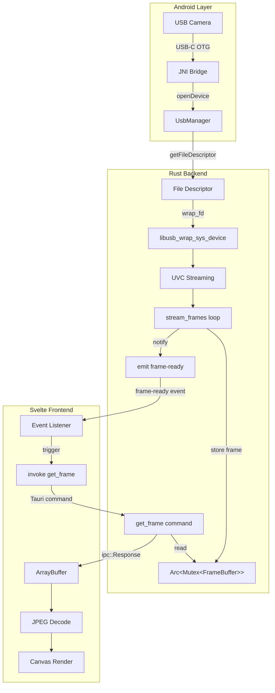
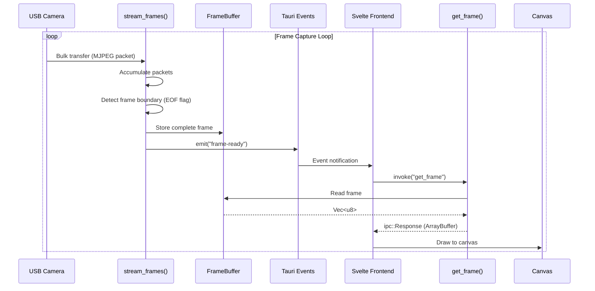
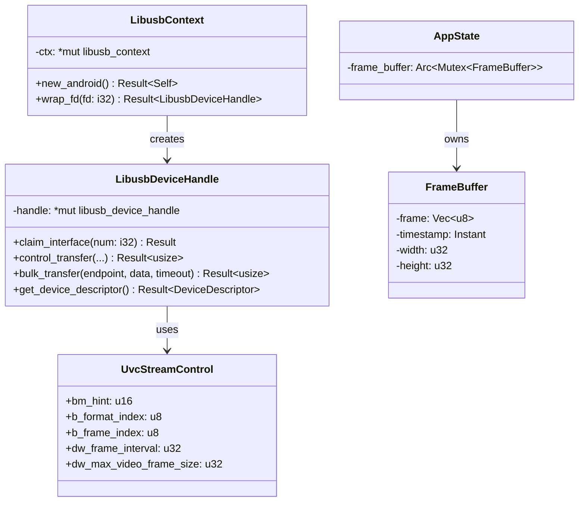

# ADR-001: Frame Streaming Architecture

## Status

**Accepted** - December 2025

## Context

CleanScope is a Tauri v2 + Rust + Svelte 5 Android application for viewing USB endoscope video feeds. The application needs to stream MJPEG frames from USB cameras to the frontend for display on an HTML5 canvas.

### Technical Constraints

- **Frame Size**: MJPEG frames typically range from 50-500KB each
- **Target Frame Rate**: ~30 fps for smooth video display
- **Data Flow**: Frames are captured via USB bulk transfers in a background Rust thread and must reach the Svelte frontend for canvas rendering
- **Platform**: Android with Tauri v2 (WebView-based rendering)
- **USB Access**: Android requires JNI to obtain file descriptors from UsbManager; direct device enumeration is blocked by SELinux

### Problem Statement

We need an efficient mechanism to transfer high-frequency, large binary payloads (MJPEG frames) from the Rust backend to the JavaScript frontend while maintaining:

1. Low latency for real-time video display
2. Minimal CPU overhead to preserve battery life
3. Memory efficiency to avoid GC pressure in the WebView

## Decision

We will implement the **Polling Pattern with `ipc::Response`** for frame streaming.

### Architecture Overview



### Sequence Diagram



### Component Diagram



## Options Considered

### Option 1: Tauri Events with Base64 Encoding

```rust
app.emit("camera-frame", base64::encode(&frame_data))?;
```

**Pros:**
- Simple implementation
- Built-in Tauri event system
- No additional state management

**Cons:**
- Base64 encoding adds ~33% size overhead (50KB frame becomes 66KB)
- JSON serialization of large strings is expensive
- Poor performance at video rates (30+ fps)
- High memory allocation pressure

**Verdict:** Rejected due to performance concerns at video frame rates.

### Option 2: Polling Pattern with `ipc::Response` (Selected)

```rust
#[tauri::command]
fn get_frame(state: State<AppState>) -> Result<tauri::ipc::Response, String> {
    let buffer = state.frame_buffer.lock().unwrap();
    Ok(tauri::ipc::Response::new(buffer.frame.clone()))
}
```

```typescript
// Frontend
listen("frame-ready", async () => {
    const frame: ArrayBuffer = await invoke("get_frame");
    renderFrame(frame);
});
```

**Pros:**
- Binary data transferred as raw `ArrayBuffer` (no Base64)
- Bypasses JSON serialization entirely
- Minimal overhead at the IPC boundary
- Frame rate controlled by notification frequency
- Natural backpressure: frontend polls only when ready

**Cons:**
- Slightly more complex than pure events
- Requires shared state (`Arc<Mutex<FrameBuffer>>`)
- Two-step process (event notification + command invocation)

**Verdict:** Selected for optimal balance of performance and implementation complexity.

### Option 3: Tauri Channels

```rust
#[tauri::command]
fn start_stream(channel: Channel<Vec<u8>>) {
    loop {
        let frame = capture_frame();
        channel.send(frame)?;
    }
}
```

**Pros:**
- Continuous streaming model
- Built-in flow control

**Cons:**
- `Channel<Vec<u8>>` serializes bytes as `number[]` before converting to `Uint8Array`
- Serialization overhead defeats the purpose
- Less control over frame timing

**Verdict:** Rejected due to serialization overhead.

### Option 4: Custom Protocol Handler

```rust
// Register custom protocol
builder.register_asynchronous_uri_scheme_protocol("frame", |_app, request, responder| {
    // Serve frames via HTTP-like protocol
});
```

**Pros:**
- Best raw performance for high-fps streaming
- HTTP-like caching semantics available

**Cons:**
- Complex implementation
- Does not work reliably on Linux (Tauri limitation)
- Overkill for ~30fps MJPEG streaming

**Verdict:** Rejected due to complexity and platform limitations.

## Implementation Details

### Rust Backend Changes

1. **Add shared frame buffer state:**

```rust
use std::sync::{Arc, Mutex};
use std::time::Instant;

pub struct FrameBuffer {
    pub frame: Vec<u8>,
    pub timestamp: Instant,
    pub width: u32,
    pub height: u32,
}

pub struct AppState {
    pub frame_buffer: Arc<Mutex<FrameBuffer>>,
}
```

2. **Modify `stream_frames()` to store frames and emit notifications:**

```rust
fn stream_frames(
    dev: &LibusbDeviceHandle,
    endpoint: u8,
    app_handle: AppHandle,
    frame_buffer: Arc<Mutex<FrameBuffer>>,
) -> Result<(), LibusbError> {
    // ... existing frame accumulation logic ...

    if end_of_frame && !frame_data.is_empty() {
        // Store frame in shared buffer
        {
            let mut buffer = frame_buffer.lock().unwrap();
            buffer.frame = frame_data.clone();
            buffer.timestamp = Instant::now();
        }

        // Notify frontend (lightweight event, no payload)
        let _ = app_handle.emit("frame-ready", ());

        frame_data.clear();
    }
}
```

3. **Add `get_frame` command:**

```rust
#[tauri::command]
fn get_frame(state: State<'_, AppState>) -> Result<tauri::ipc::Response, String> {
    let buffer = state.frame_buffer.lock()
        .map_err(|e| format!("Lock error: {}", e))?;

    if buffer.frame.is_empty() {
        return Err("No frame available".to_string());
    }

    Ok(tauri::ipc::Response::new(buffer.frame.clone()))
}
```

### Frontend Changes

```typescript
// App.svelte
import { invoke } from "@tauri-apps/api/core";
import { listen } from "@tauri-apps/api/event";

let canvas: HTMLCanvasElement;
let ctx: CanvasRenderingContext2D;

onMount(async () => {
    ctx = canvas.getContext("2d")!;

    await listen("frame-ready", async () => {
        try {
            const frameData: ArrayBuffer = await invoke("get_frame");
            await renderFrame(frameData);
        } catch (e) {
            console.error("Frame fetch failed:", e);
        }
    });
});

async function renderFrame(data: ArrayBuffer) {
    const blob = new Blob([data], { type: "image/jpeg" });
    const bitmap = await createImageBitmap(blob);
    ctx.drawImage(bitmap, 0, 0, canvas.width, canvas.height);
    bitmap.close();
}
```

### Key Files

| File | Purpose |
|------|---------|
| `/Users/lgates/repos/laurigates/CleanScope/src-tauri/src/lib.rs` | Tauri setup, commands, events, AppState management |
| `/Users/lgates/repos/laurigates/CleanScope/src-tauri/src/usb.rs` | USB handling, UVC streaming, frame capture loop |
| `/Users/lgates/repos/laurigates/CleanScope/src-tauri/src/libusb_android.rs` | libusb FFI wrappers for Android |
| `/Users/lgates/repos/laurigates/CleanScope/src/App.svelte` | Frontend UI, canvas rendering, event handling |

## Consequences

### Positive

1. **Efficient Binary Transfer**: Raw `ArrayBuffer` transfer eliminates Base64 encoding overhead
2. **Natural Backpressure**: Frontend only requests frames when ready to render, preventing queue buildup
3. **Memory Efficiency**: Single frame buffer reused; old frames overwritten, not queued
4. **Decoupled Timing**: Frame capture rate and display rate can differ naturally
5. **Debug-Friendly**: Frame-ready events can be logged/counted for diagnostics

### Negative

1. **Potential Frame Drops**: If frontend is slower than capture rate, intermediate frames are lost (acceptable for live video)
2. **Lock Contention**: Mutex on frame buffer could cause brief contention (mitigated by fast lock/unlock)
3. **Two-Step Fetch**: Slight latency increase from event + command vs. single event (negligible in practice)

### Risks and Mitigations

| Risk | Mitigation |
|------|------------|
| Lock contention under high frame rate | Use `parking_lot::Mutex` if std mutex proves slow |
| Memory pressure from large frames | Single buffer design; consider frame size cap |
| Frontend falls behind capture rate | Acceptable for live video; frame drops are invisible |
| WebView GC pauses | `createImageBitmap()` is efficient; avoid creating intermediate objects |

## Related Decisions

- **ADR-002** (future): JPEG decoding strategy (Rust-side vs. browser-native)
- **ADR-003** (future): Resolution negotiation protocol

## References

- [Tauri IPC Documentation](https://tauri.app/develop/calling-rust/)
- [Tauri ipc::Response for Binary Data](https://docs.rs/tauri/latest/tauri/ipc/struct.Response.html)
- [USB Video Class (UVC) Specification](https://www.usb.org/document-library/video-class-v15-document-set)
- [libusb Documentation](https://libusb.info/)
