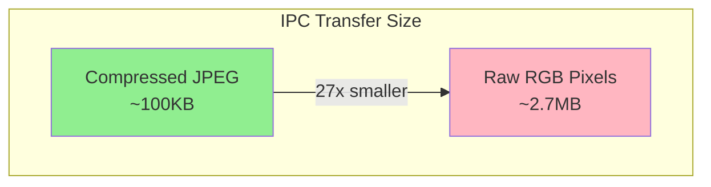
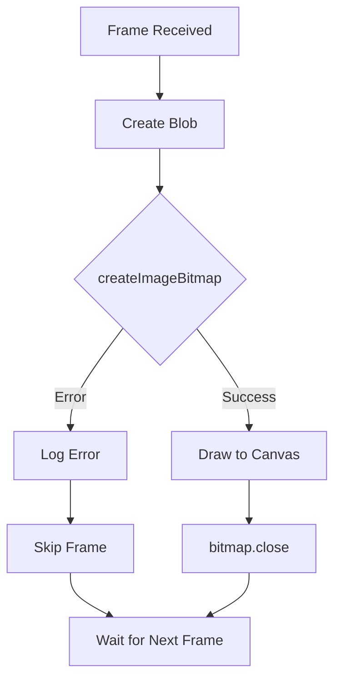

# ADR-002: JPEG Decoding Strategy

## Status

**Accepted** - December 2025

## Context

CleanScope streams MJPEG frames from USB endoscopes to the frontend for display. As established in [ADR-001](./001-frame-streaming-architecture.md), raw JPEG bytes are transferred via `ipc::Response` as an `ArrayBuffer`. This decision addresses where and how to decode those JPEG frames into renderable pixels.

### Technical Constraints

- **Frame Format**: MJPEG (Motion JPEG) - each frame is an independent JPEG image
- **Frame Size**: Compressed JPEG frames typically 50-500KB
- **Decoded Size**: RGB pixels at 1280x720 = ~2.7MB per frame (3 bytes per pixel)
- **Target Frame Rate**: ~30 fps
- **Platform**: Android WebView (Chromium-based) with hardware JPEG decode capability

### Problem Statement

We need to decide whether to:
1. Decode JPEG frames in Rust before sending to frontend
2. Send compressed JPEG to frontend and decode in browser
3. Use a hybrid approach with Rust validation and browser decoding

## Decision

We will implement **Option 1: Browser-Native JPEG Decoding** using the `createImageBitmap()` API.

### Decode Flow

```mermaid
flowchart LR
    subgraph Rust["Rust Backend"]
        FB[FrameBuffer]
        CMD[get_frame]
        IPC["ipc::Response"]
    end

    subgraph IPC_Layer["IPC Transfer"]
        AB["ArrayBuffer<br/>(compressed JPEG)"]
    end

    subgraph Browser["Browser/WebView"]
        BLOB[Blob]
        CIB["createImageBitmap()"]
        GPU["GPU Decode<br/>(hardware accelerated)"]
        BMP[ImageBitmap]
        CVS["Canvas.drawImage()"]
    end

    FB -->|"lock & read"| CMD
    CMD -->|"raw bytes"| IPC
    IPC -->|"~100KB"| AB
    AB -->|"new Blob()"| BLOB
    BLOB -->|"async decode"| CIB
    CIB -->|"hardware path"| GPU
    GPU --> BMP
    BMP -->|"render"| CVS
```



### Data Size Comparison



## Options Considered

### Option 1: Browser-Native Decoding (Selected)

Send raw JPEG bytes to frontend; decode using `createImageBitmap()`.

```typescript
// Frontend rendering
async function renderFrame(data: ArrayBuffer) {
    const blob = new Blob([data], { type: "image/jpeg" });
    const bitmap = await createImageBitmap(blob);
    ctx.drawImage(bitmap, 0, 0, canvas.width, canvas.height);
    bitmap.close(); // Release GPU memory
}
```

**Pros:**
- **Hardware Acceleration**: Modern browsers/WebViews use GPU-accelerated JPEG decode
- **Minimal IPC Overhead**: Transfer compressed data (~100KB vs ~2.7MB)
- **Zero Rust Complexity**: No image decoding dependencies in Rust
- **Optimized Memory**: Browser manages decode buffers efficiently
- **Async Non-Blocking**: `createImageBitmap()` returns a Promise, doesn't block UI

**Cons:**
- Decode errors surface in JavaScript (not Rust)
- Slightly delayed error detection (decode happens after transfer)

**Verdict:** Selected. Hardware acceleration and smaller transfer size outweigh minor error handling concerns.

### Option 2: Rust-Side Decoding with jpeg-decoder

Decode JPEG to raw RGB pixels in Rust using the `jpeg-decoder` crate.

```rust
use jpeg_decoder::Decoder;

#[tauri::command]
fn get_frame(state: State<'_, AppState>) -> Result<tauri::ipc::Response, String> {
    let buffer = state.frame_buffer.lock().unwrap();

    // Decode JPEG to RGB
    let mut decoder = Decoder::new(&buffer.frame[..]);
    let pixels = decoder.decode()
        .map_err(|e| format!("JPEG decode error: {}", e))?;

    Ok(tauri::ipc::Response::new(pixels))
}
```

```typescript
// Frontend rendering (raw pixels)
async function renderFrame(data: ArrayBuffer) {
    const imageData = new ImageData(
        new Uint8ClampedArray(data),
        width,
        height
    );
    ctx.putImageData(imageData, 0, 0);
}
```

**Pros:**
- Early error detection in Rust
- Frontend receives ready-to-render pixels
- Consistent decode behavior across platforms

**Cons:**
- **27x Larger Transfer**: 2.7MB (RGB) vs 100KB (JPEG) per frame
- **CPU-Bound Decoding**: No hardware acceleration in Rust
- **Added Dependency**: `jpeg-decoder` crate (already in Cargo.toml but unused)
- **Higher Latency**: Software decode is slower than hardware

**Verdict:** Rejected. The 27x increase in transfer size is prohibitive at 30fps.

### Option 3: Hybrid - Rust Validation, Browser Decoding

Rust validates JPEG headers and extracts metadata; browser performs actual decode.

```rust
use jpeg_decoder::Decoder;

#[tauri::command]
fn get_frame(state: State<'_, AppState>) -> Result<FrameResponse, String> {
    let buffer = state.frame_buffer.lock().unwrap();

    // Validate and extract metadata only
    let mut decoder = Decoder::new(&buffer.frame[..]);
    decoder.read_info()
        .map_err(|e| format!("Invalid JPEG: {}", e))?;

    let info = decoder.info().unwrap();

    Ok(FrameResponse {
        data: buffer.frame.clone(),
        width: info.width,
        height: info.height,
    })
}
```

**Pros:**
- Early validation catches corrupt frames
- Metadata (width/height) available before decode
- Still transfers compressed data

**Cons:**
- Partial decode overhead on every frame
- Added complexity for marginal benefit
- Browser already handles corrupt JPEGs gracefully

**Verdict:** Rejected. The validation overhead doesn't justify the complexity. Browser decode errors can be caught with try/catch.

## Implementation Details

### Frontend Code

```typescript
// src/App.svelte
import { invoke } from "@tauri-apps/api/core";
import { listen } from "@tauri-apps/api/event";
import { onMount } from "svelte";

let canvas: HTMLCanvasElement;
let ctx: CanvasRenderingContext2D;
let frameCount = 0;
let decodeErrors = 0;

onMount(async () => {
    ctx = canvas.getContext("2d")!;

    await listen("frame-ready", async () => {
        try {
            const frameData: ArrayBuffer = await invoke("get_frame");
            await renderFrame(frameData);
            frameCount++;
        } catch (e) {
            console.error("Frame fetch failed:", e);
        }
    });
});

async function renderFrame(data: ArrayBuffer) {
    try {
        const blob = new Blob([data], { type: "image/jpeg" });
        const bitmap = await createImageBitmap(blob);

        // Resize canvas to match frame dimensions
        if (canvas.width !== bitmap.width || canvas.height !== bitmap.height) {
            canvas.width = bitmap.width;
            canvas.height = bitmap.height;
        }

        ctx.drawImage(bitmap, 0, 0);
        bitmap.close(); // Important: release GPU resources
    } catch (e) {
        decodeErrors++;
        console.error("JPEG decode failed:", e);
        // Skip frame - next frame will render normally
    }
}
```

### Error Handling Strategy



### Performance Characteristics

| Metric | Browser-Native | Rust-Side |
|--------|---------------|-----------|
| Transfer size per frame | ~100KB | ~2.7MB |
| Bandwidth at 30fps | ~3 MB/s | ~81 MB/s |
| Decode method | Hardware (GPU) | Software (CPU) |
| Decode latency | <5ms | ~15-30ms |
| Memory pressure | Low (browser managed) | High (allocation per frame) |

### Browser Compatibility

The `createImageBitmap()` API is supported in:
- Chrome/Chromium 50+ (Android WebView)
- Firefox 42+
- Safari 15+
- Edge 79+

Since Tauri on Android uses the system WebView (Chromium-based), hardware-accelerated JPEG decoding is available on all supported Android versions (7.0+).

## Consequences

### Positive

1. **Optimal Performance**: Hardware-accelerated decode leverages GPU capabilities
2. **Minimal Bandwidth**: Compressed JPEG transfer uses 27x less IPC bandwidth
3. **Simplified Backend**: No image processing dependencies needed in Rust
4. **Battery Efficient**: GPU decode is more power-efficient than CPU software decode
5. **Memory Efficient**: Browser manages decode buffers with efficient pooling

### Negative

1. **Error Location**: Decode errors surface in JavaScript rather than Rust
2. **Debugging**: Corrupt frame issues require frontend debugging tools
3. **Platform Dependency**: Relies on WebView's JPEG decoder implementation

### Risks and Mitigations

| Risk | Mitigation |
|------|------------|
| Corrupt JPEG frames | Try/catch in `renderFrame()`, skip and wait for next frame |
| Memory leaks | Always call `bitmap.close()` after rendering |
| Decode performance varies | Hardware acceleration available on all target devices |
| Large frame spike | Compressed JPEG limits maximum transfer size |

## Related Decisions

- [ADR-001: Frame Streaming Architecture](./001-frame-streaming-architecture.md) - Defines the IPC mechanism this decision builds upon
- **ADR-003** (future): Resolution negotiation protocol

## References

- [MDN: createImageBitmap()](https://developer.mozilla.org/en-US/docs/Web/API/createImageBitmap)
- [MDN: ImageBitmap](https://developer.mozilla.org/en-US/docs/Web/API/ImageBitmap)
- [Chromium JPEG Decode Architecture](https://chromium.googlesource.com/chromium/src/+/main/media/gpu/vaapi/)
- [jpeg-decoder crate](https://crates.io/crates/jpeg-decoder) (evaluated but not used)
