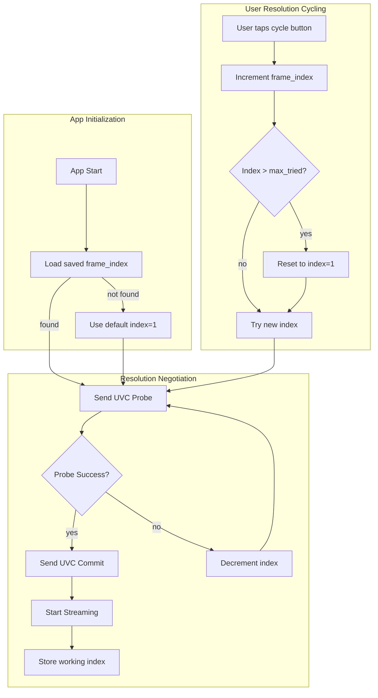
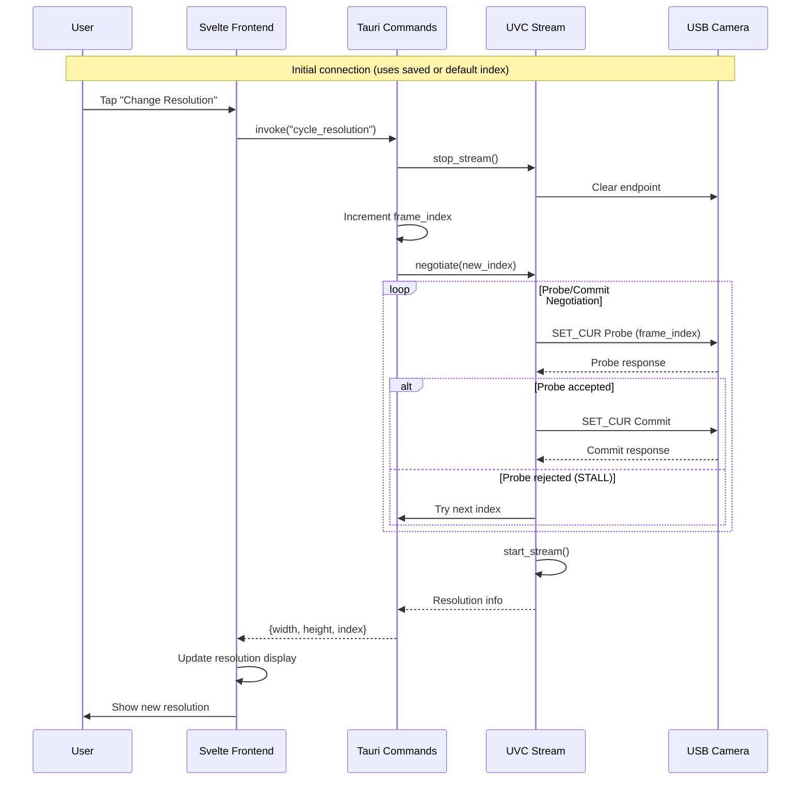

# ADR-003: Resolution Negotiation Protocol

## Status

**Accepted** - December 2025

## Context

USB endoscopes support multiple video resolutions (e.g., 640x480, 1280x720, 1920x1080). CleanScope needs a strategy for discovering available resolutions, selecting an initial resolution, and allowing users to change resolutions during operation.

### Technical Background

UVC (USB Video Class) cameras advertise supported video formats through USB descriptors:

- **Format Descriptors**: Define the compression format (MJPEG, uncompressed YUV, etc.)
- **Frame Descriptors**: Define available resolutions and frame rates for each format
- **Probe/Commit Control**: UVC uses a two-phase negotiation where the host proposes settings (Probe) and then commits them

Resolution selection involves:
1. Setting `bFormatIndex` (which compression format)
2. Setting `bFrameIndex` (which resolution within that format)
3. Sending Probe control transfer to negotiate
4. Sending Commit control transfer to finalize

### Current Implementation

The current implementation uses hardcoded values:

```rust
UvcStreamControl {
    bm_hint: 1,           // Frame interval hint
    b_format_index: 1,    // First format (usually MJPEG)
    b_frame_index: 1,     // First resolution
    dw_frame_interval: 333333, // ~30fps
    // ...
}
```

This works for basic operation but:
- Does not discover what resolutions are available
- Cannot adapt to different cameras with different capabilities
- Provides no user control over video quality vs. performance tradeoffs

### Problem Statement

We need a resolution negotiation strategy that:
1. Works reliably across different USB endoscopes
2. Allows users to select preferred resolution
3. Balances implementation complexity with functionality
4. Maintains stable video streaming during resolution changes

## Decision

We will implement **Progressive Negotiation** for the MVP, with USB descriptor parsing as a future enhancement.

### Architecture Overview



### Resolution Cycling Sequence



### UVC Control Transfer Details

Resolution negotiation uses UVC Video Streaming (VS) interface control transfers:

```rust
// Control transfer parameters for Probe/Commit
const VS_PROBE_CONTROL: u8 = 0x01;
const VS_COMMIT_CONTROL: u8 = 0x02;
const SET_CUR: u8 = 0x01;
const GET_CUR: u8 = 0x81;
const GET_MIN: u8 = 0x82;
const GET_MAX: u8 = 0x83;

// bmRequestType for Video Streaming interface
const REQUEST_TYPE_SET: u8 = 0x21;  // Host-to-device, Class, Interface
const REQUEST_TYPE_GET: u8 = 0xA1;  // Device-to-host, Class, Interface

// UvcStreamControl structure (34 bytes for UVC 1.1+)
#[repr(C, packed)]
struct UvcStreamControl {
    bm_hint: u16,              // Negotiation hints
    b_format_index: u8,        // Format descriptor index
    b_frame_index: u8,         // Frame descriptor index
    dw_frame_interval: u32,    // Frame interval in 100ns units
    w_key_frame_rate: u16,     // Key frame rate
    w_p_frame_rate: u16,       // P-frame rate
    w_comp_quality: u16,       // Compression quality
    w_comp_window_size: u16,   // Compression window size
    w_delay: u16,              // Internal latency
    dw_max_video_frame_size: u32,  // Max frame size
    dw_max_payload_transfer_size: u32,  // Max payload per packet
    // UVC 1.1+ additional fields
    dw_clock_frequency: u32,
    bm_framing_info: u8,
    b_preferred_version: u8,
    b_min_version: u8,
    b_max_version: u8,
}
```

### Negotiation Protocol

```rust
fn negotiate_resolution(
    dev: &LibusbDeviceHandle,
    format_index: u8,
    frame_index: u8,
    interface_num: u8,
) -> Result<UvcStreamControl, UvcError> {
    let mut ctrl = UvcStreamControl::default();
    ctrl.bm_hint = 1;  // Frame interval hint
    ctrl.b_format_index = format_index;
    ctrl.b_frame_index = frame_index;
    ctrl.dw_frame_interval = 333333;  // 30fps default

    // Phase 1: Probe - propose settings
    dev.control_transfer(
        REQUEST_TYPE_SET,
        SET_CUR,
        (VS_PROBE_CONTROL as u16) << 8,
        interface_num as u16,
        ctrl.as_bytes(),
        TIMEOUT,
    )?;

    // Read back negotiated values
    let mut response = [0u8; 34];
    dev.control_transfer(
        REQUEST_TYPE_GET,
        GET_CUR,
        (VS_PROBE_CONTROL as u16) << 8,
        interface_num as u16,
        &mut response,
        TIMEOUT,
    )?;

    let negotiated = UvcStreamControl::from_bytes(&response);

    // Phase 2: Commit - finalize settings
    dev.control_transfer(
        REQUEST_TYPE_SET,
        SET_CUR,
        (VS_COMMIT_CONTROL as u16) << 8,
        interface_num as u16,
        negotiated.as_bytes(),
        TIMEOUT,
    )?;

    Ok(negotiated)
}
```

## Options Considered

### Option 1: Static Default Resolution

Always use `format_index=1, frame_index=1` (current behavior).

**Pros:**
- Simplest implementation
- Works with most cameras (first format is usually MJPEG, first frame is usually lowest resolution)
- No state management needed

**Cons:**
- No user control over quality/performance tradeoff
- May not be optimal resolution (often lowest available)
- Cannot adapt to cameras with different descriptor layouts

**Verdict:** Insufficient for a good user experience.

### Option 2: Parse USB Descriptors

Read and parse UVC format and frame descriptors to build a complete list of available resolutions.

```rust
// Parse configuration descriptor to find VideoStreaming interface
// Then parse VS_FORMAT_MJPEG and VS_FRAME_MJPEG descriptors
struct FrameDescriptor {
    index: u8,
    width: u16,
    height: u16,
    min_frame_interval: u32,
    max_frame_interval: u32,
}

fn enumerate_resolutions(dev: &LibusbDeviceHandle) -> Vec<FrameDescriptor> {
    let config_desc = dev.get_active_config_descriptor()?;
    // Walk through descriptors looking for UVC-specific ones
    // Parse bDescriptorSubtype 0x06 (VS_FORMAT_MJPEG)
    // Parse bDescriptorSubtype 0x07 (VS_FRAME_MJPEG)
}
```

**Pros:**
- Complete knowledge of camera capabilities
- Can present exact resolution list to user
- Can auto-select optimal resolution (e.g., highest that fits screen)

**Cons:**
- Complex descriptor parsing code
- Must handle different UVC versions (1.0, 1.1, 1.5)
- Some cameras have non-compliant descriptors
- Significant implementation effort

**Verdict:** Good for future enhancement but too complex for MVP.

### Option 3: Progressive Negotiation (Selected)

Start with a default or previously-saved frame index, and allow users to cycle through available resolutions. Learn what works through trial and error.

**Pros:**
- Simple implementation
- Adaptive to any camera
- Persists user preference
- Graceful handling of failed negotiations

**Cons:**
- Cannot show resolution list upfront
- Brief stream interruption when cycling
- Trial-and-error discovery

**Verdict:** Selected for MVP. Balances simplicity with functionality.

## Implementation Details

### State Management

```rust
// Add to AppState
pub struct ResolutionState {
    pub current_format_index: u8,
    pub current_frame_index: u8,
    pub max_known_frame_index: u8,  // Highest index that worked
    pub current_width: u32,
    pub current_height: u32,
}

pub struct AppState {
    pub frame_buffer: Arc<Mutex<FrameBuffer>>,
    pub resolution: Arc<Mutex<ResolutionState>>,
}
```

### Tauri Commands

```rust
#[tauri::command]
async fn cycle_resolution(
    state: State<'_, AppState>,
    app: AppHandle,
) -> Result<ResolutionInfo, String> {
    let mut res = state.resolution.lock().unwrap();

    // Stop current stream
    stop_streaming(&app)?;

    // Try next frame index
    let mut next_index = res.current_frame_index + 1;
    if next_index > res.max_known_frame_index + 1 {
        next_index = 1;  // Wrap around
    }

    // Attempt negotiation
    match try_negotiate(res.current_format_index, next_index) {
        Ok(negotiated) => {
            res.current_frame_index = next_index;
            res.current_width = extract_width(&negotiated);
            res.current_height = extract_height(&negotiated);

            if next_index > res.max_known_frame_index {
                res.max_known_frame_index = next_index;
            }

            // Persist preference
            save_resolution_preference(next_index)?;

            // Restart stream
            start_streaming(&app)?;

            Ok(ResolutionInfo {
                width: res.current_width,
                height: res.current_height,
                index: next_index,
            })
        }
        Err(_) => {
            // This index doesn't work, try the next one recursively
            // or wrap to index 1
            res.current_frame_index = 1;
            // ... negotiate with index 1 ...
        }
    }
}

#[tauri::command]
fn get_current_resolution(state: State<'_, AppState>) -> ResolutionInfo {
    let res = state.resolution.lock().unwrap();
    ResolutionInfo {
        width: res.current_width,
        height: res.current_height,
        index: res.current_frame_index,
    }
}
```

### Frontend UI

```svelte
<script lang="ts">
    import { invoke } from "@tauri-apps/api/core";

    let currentResolution = $state({ width: 0, height: 0, index: 1 });
    let isCycling = $state(false);

    async function cycleResolution() {
        if (isCycling) return;
        isCycling = true;

        try {
            currentResolution = await invoke("cycle_resolution");
        } catch (e) {
            console.error("Resolution change failed:", e);
        } finally {
            isCycling = false;
        }
    }

    onMount(async () => {
        currentResolution = await invoke("get_current_resolution");
    });
</script>

<div class="controls">
    <button onclick={cycleResolution} disabled={isCycling}>
        {isCycling ? "Changing..." : "Change Resolution"}
    </button>
    <span class="resolution-display">
        {currentResolution.width}x{currentResolution.height}
    </span>
</div>
```

### Persistence

Resolution preference stored via Tauri's app data directory:

```rust
use tauri::api::path::app_data_dir;
use std::fs;

fn save_resolution_preference(frame_index: u8) -> Result<(), std::io::Error> {
    let path = app_data_dir(&app.config())
        .ok_or_else(|| std::io::Error::new(std::io::ErrorKind::NotFound, "No app data dir"))?
        .join("resolution.json");

    let data = serde_json::json!({ "frame_index": frame_index });
    fs::write(path, serde_json::to_string(&data)?)?;
    Ok(())
}

fn load_resolution_preference() -> u8 {
    // Return saved index or default to 1
    let path = app_data_dir(&app.config())
        .map(|p| p.join("resolution.json"));

    path.and_then(|p| fs::read_to_string(p).ok())
        .and_then(|s| serde_json::from_str::<serde_json::Value>(&s).ok())
        .and_then(|v| v["frame_index"].as_u64())
        .map(|i| i as u8)
        .unwrap_or(1)
}
```

### Key Files

| File | Purpose |
|------|---------|
| `src-tauri/src/lib.rs` | Add `cycle_resolution`, `get_current_resolution` commands |
| `src-tauri/src/usb.rs` | UVC Probe/Commit implementation, negotiation logic |
| `src/App.svelte` | Resolution display and cycle button UI |
| `src-tauri/src/state.rs` | ResolutionState management (new file) |

## Consequences

### Positive

1. **User Control**: Users can adjust resolution based on their needs (quality vs. battery)
2. **Adaptive**: Works with any UVC-compliant camera regardless of descriptor layout
3. **Persistent**: Remembers user preference across sessions
4. **Graceful Degradation**: Falls back to working resolution if negotiation fails
5. **Incremental**: Can add descriptor parsing later without changing the user-facing API

### Negative

1. **Discovery UX**: Cannot show resolution list upfront; user must cycle to discover options
2. **Stream Interruption**: Brief pause (~100-500ms) when changing resolution
3. **Trial and Error**: May need several cycles to find preferred resolution on first use

### Risks and Mitigations

| Risk | Mitigation |
|------|------------|
| Camera hangs during negotiation | Implement timeout, fallback to index 1 |
| Rapid cycling causes instability | Debounce button, disable during transition |
| Stream fails to restart | Automatic reconnection with last known good settings |
| Non-UVC-compliant cameras | Document that UVC compliance is required |

## Future Enhancements

### Phase 2: Descriptor Parsing

Add USB descriptor parsing to enumerate available resolutions:

```rust
// Future: Parse descriptors to show resolution picker
fn get_available_resolutions() -> Vec<Resolution> {
    // Parse VS_FORMAT_MJPEG and VS_FRAME_MJPEG descriptors
    // Return sorted list of available resolutions
}
```

This would enable:
- Resolution picker dropdown instead of cycling
- Auto-select optimal resolution based on screen size
- Display actual available options to user

### Phase 3: Quality Presets

Define named presets that map to frame indices:

- **Low Power**: Lowest resolution, saves battery
- **Balanced**: Middle resolution
- **High Quality**: Highest resolution

## Related Decisions

- **ADR-001**: Frame Streaming Architecture (defines how frames reach frontend)
- **ADR-002** (future): JPEG Decoding Strategy

## References

- [USB Video Class 1.5 Specification](https://www.usb.org/document-library/video-class-v15-document-set) - Section 4.3 (VideoStreaming Interface Controls)
- [USB Video Class Control Messages](https://www.kernel.org/doc/html/latest/driver-api/media/drivers/uvcvideo.html)
- [libuvc documentation](https://ken.tossell.net/libuvc/doc/)
- [Tauri App Data Directory](https://tauri.app/develop/api/path/)
