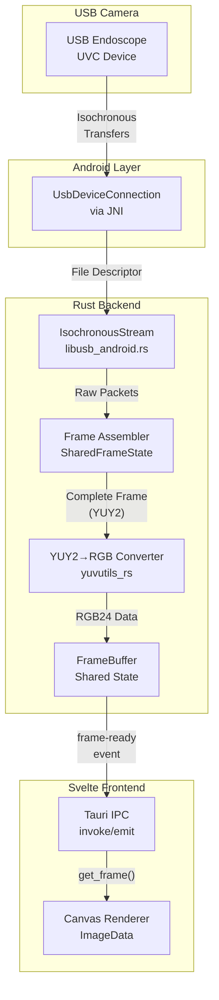
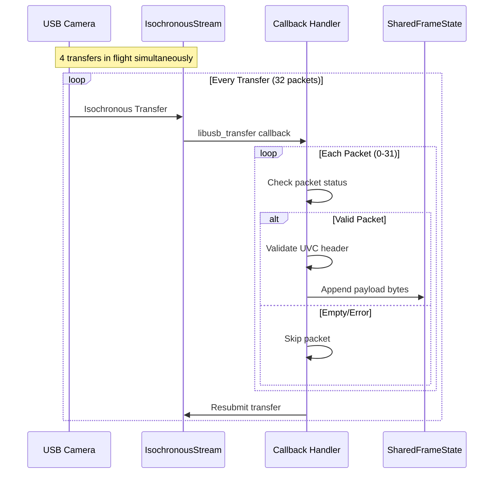
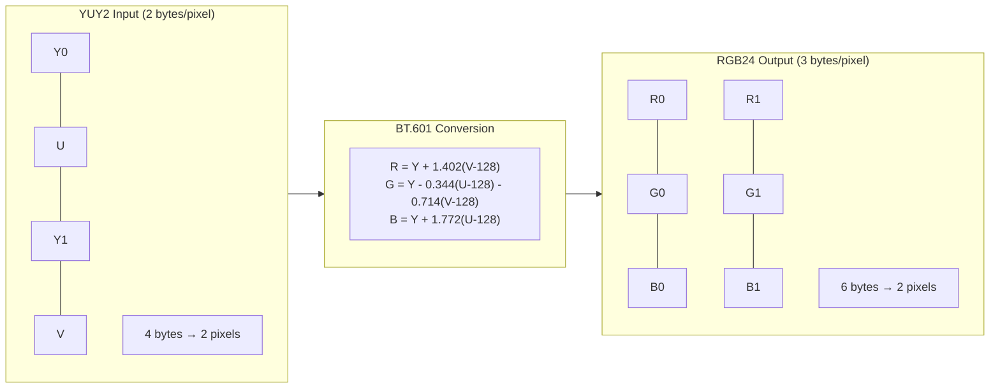
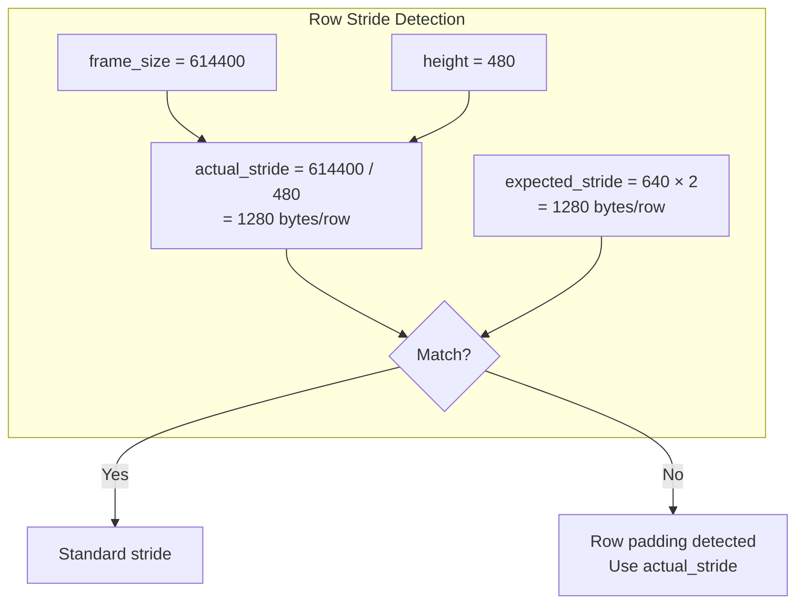
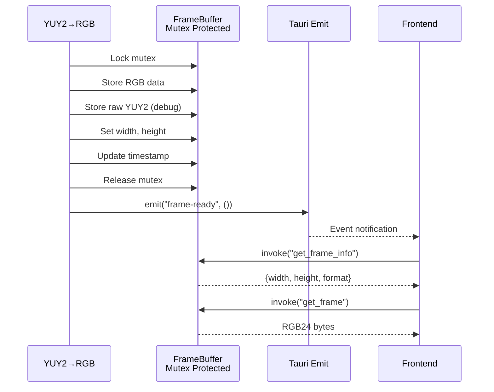

# CleanScope Image Processing Pipeline

This document describes the complete image processing pipeline from USB data reception to frame display.

## High-Level Overview



## Detailed Pipeline Stages

### Stage 1: USB Isochronous Transfer Reception



### Stage 2: Frame Assembly (Critical Logic)

```mermaid
flowchart TB
    subgraph Input["Packet Processing"]
        PKT[ISO Packet<br/>512 bytes max]
        HDR{UVC Header<br/>Present?}
        VAL{Header<br/>Valid?}
    end

    subgraph Header["UVC Header Analysis"]
        EOH[EOH bit = 0x80<br/>End of Header]
        EOF[EOF bit = 0x02<br/>End of Frame]
        FID[FID bit = 0x01<br/>Frame ID toggle]
        PTS[PTS present?<br/>bits 2-5]
    end

    subgraph Detection["Format Detection"]
        JPEG{First bytes<br/>= 0xFFD8?}
        MJPEG[MJPEG Mode]
        YUY2[YUY2 Mode]
    end

    subgraph Assembly["Frame Completion"]
        SIZE{buffer.len() >=<br/>expected_size?}
        EOFCHK{EOF flag<br/>set?}
        EMIT[Emit Complete Frame]
        CLEAR[Clear Buffer]
    end

    PKT --> HDR
    HDR -->|"Yes (len > 0)"| VAL
    HDR -->|"No header"| APPEND[Append all bytes]
    VAL -->|"Valid"| EOH
    VAL -->|"Invalid"| APPEND

    EOH --> EOF
    EOF --> FID

    EOH --> PAYLOAD[Skip header_len bytes]
    PAYLOAD --> APPEND

    APPEND --> JPEG
    JPEG -->|"Yes"| MJPEG
    JPEG -->|"No"| YUY2

    YUY2 --> SIZE
    SIZE -->|"Yes"| EMIT
    SIZE -->|"No"| WAIT[Wait for more packets]

    MJPEG --> EOFCHK
    EOFCHK -->|"Yes"| EMIT
    EOFCHK -->|"No"| WAIT

    EMIT --> CLEAR
```

### Stage 3: Frame Size Detection (The Fix)

```mermaid
flowchart TB
    subgraph Problem["Previous Bug"]
        PROBE[UVC Probe Response<br/>max_frame_size = 1843200<br/>&#40;1280×720&#41;]
        DESC[UVC Descriptor<br/>640×480 only]
        INFER[❌ Inferred 1280×720<br/>from probe response]
        WAIT3[Waited for 1843200 bytes]
        CONCAT[3 VGA frames concatenated<br/>&#40;3 × 614400 = 1843200&#41;]
        BAND[Horizontal banding<br/>artifacts]
    end

    subgraph Fix["Current Fix"]
        DESC2[UVC Descriptor<br/>640×480]
        TRUST[✅ Trust descriptor<br/>resolution]
        CALC[expected_size =<br/>640 × 480 × 2 = 614400]
        PASS[Pass to IsochronousStream]
        CORRECT[Correct frame detection]
    end

    PROBE --> INFER
    DESC --> INFER
    INFER --> WAIT3
    WAIT3 --> CONCAT
    CONCAT --> BAND

    DESC2 --> TRUST
    TRUST --> CALC
    CALC --> PASS
    PASS --> CORRECT

    style INFER fill:#f66,color:#000
    style TRUST fill:#6f6,color:#000
```



### Stage 4: YUY2 to RGB Conversion



**Stride Handling:**



### Stage 5: Frame Buffer & IPC



### Stage 6: Canvas Rendering

```mermaid
flowchart TB
    subgraph Input["Frame Data"]
        INFO[get_frame_info<br/>width, height, format]
        DATA[get_frame<br/>RGB24 bytes]
    end

    subgraph Format{Format?}
        FMT{format}
    end

    subgraph JPEG["JPEG Path"]
        BLOB[new Blob&#40;data, 'image/jpeg'&#41;]
        BMP[createImageBitmap&#40;blob&#41;]
        DRAW1[ctx.drawImage&#40;bitmap&#41;]
    end

    subgraph RGB["RGB24 Path"]
        RGBA["Convert RGB24 → RGBA32<br/>Add alpha = 0xFF"]
        IMGDATA[new ImageData&#40;rgba, w, h&#41;]
        DRAW2[ctx.putImageData&#40;imgData&#41;]
    end

    INFO --> FMT
    DATA --> FMT

    FMT -->|"JPEG"| BLOB
    FMT -->|"RGB24"| RGBA

    BLOB --> BMP --> DRAW1
    RGBA --> IMGDATA --> DRAW2
```

## Data Sizes at Each Stage

| Stage | Format | Bytes per Pixel | 640×480 Frame Size |
|-------|--------|-----------------|-------------------|
| USB Transfer | Packets | Variable | ~32KB/transfer |
| Frame Buffer | YUY2 | 2 | 614,400 bytes |
| Conversion Output | RGB24 | 3 | 921,600 bytes |
| Canvas Display | RGBA32 | 4 | 1,228,800 bytes |

## Key Implementation Details

### Frame Completion Detection

**MJPEG:**
- Uses JPEG markers (SOI=0xFFD8, EOI=0xFFD9)
- EOF flag from UVC header triggers send
- FID toggle indicates frame boundary

**YUY2 (Uncompressed):**
- Size-based detection only
- `expected_frame_size` from UVC descriptor
- FID toggle NOT reliable (camera toggles mid-frame)

### Critical Fix Applied

The camera's UVC probe response reported `max_frame_size=1843200` (720p) but the descriptor showed only 640×480 support. The code now:

1. **Trusts the descriptor** for resolution (authoritative source)
2. **Calculates expected_frame_size** from descriptor: `width × height × 2`
3. **Passes this through** to `IsochronousStream::new()`
4. **Uses it for frame detection** instead of probe response

This prevents concatenation of multiple frames which caused horizontal banding.
